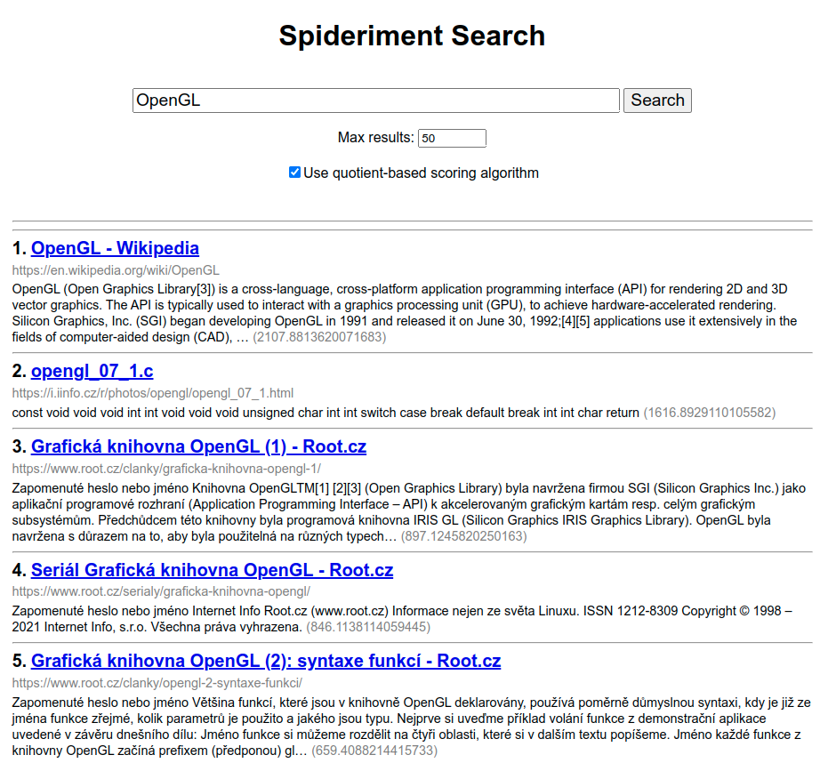

# Spideriment Web Search
**Spideriment Web Search** is a proof-of-concept **search engine** web app, which uses the Flask framework, acting like a web frontend for the [Spideriment Search Server](https://github.com/vitlabuda/spideriment_search_server). 
It proxies search queries from web clients to the search server and displays returned search results. 




## Usage

### 1. Requirements
   * **Linux**
   * **Python 3.7+**
   
   The program was tested in Python 3.7 (Debian 10) and Python 3.8 (Ubuntu 20.04).


### 2. Change the configuration to fit your needs
   The app's configuration can be changed in the **[Settings.py](src/Settings.py)** file.


### 3. Initialize the app's environment
   The bash script [prepare_web_search.sh](src/prepare_web_search.sh) creates a virtual environment and downloads the necessary Python libraries:
   ```
   ./prepare_web_search.sh
   ```


### 4. Start the Flask app
   To start the web app using the Flask's built-in development server, use the [run_debug_web_search.sh](src/run_debug_web_search.sh) bash script:
   ```
   ./run_debug_web_search.sh
   ```

   To run the app in a production environment, [hook it to a web server](https://flask.palletsprojects.com/en/latest/deploying/) using an appropriate interface.


## Related projects
* **[Spideriment](https://github.com/vitlabuda/spideriment)** – web crawler (spider, indexer)
* **[Spideriment Search Server](https://github.com/vitlabuda/spideriment_search_server)** – search server for use by frontends


## Licensing
This project is licensed under the 3-clause BSD license. See the [LICENSE](LICENSE) file for details.

Written by [Vít Labuda](https://vitlabuda.cz/).
